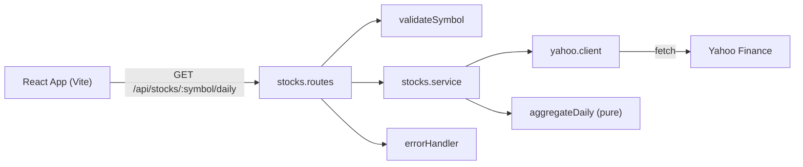

# Stock Intraday Viewer - Phased Implementation Plan

## Decisions (from your notes + answers)

- Stack: Express + TypeScript backend, React + Vite + TypeScript frontend, Recharts, Vitest for tests. The repo uses npm workspaces (`server/`, `client/`) with a root `package.json`.
- Endpoint: `GET /api/stocks/:symbol/daily` calls `https://query1.finance.yahoo.com/v8/finance/chart/{SYMBOL}?interval=15m&range=1mo`.
- Days are grouped in **exchange-local time** using `meta.exchangeTimezoneName` (e.g. `America/New_York`) with `Intl.DateTimeFormat`. Don't use `gmtoffset`: it is a single fixed offset, so it gives wrong days when a daylight-saving change falls inside the month.
- Allowed symbols: the full Yahoo range (`AAPL`, `BRK-B`, `^GSPC`, `EURUSD=X`, `BTC-USD`).
- Null candles are skipped. A day where every candle is null is left out of the output.
- Output: `[{ "day": "YYYY-MM-DD", "lowAverage": number(4dp), "highAverage": number(4dp), "volume": integer }]`, sorted by day, oldest first.

## Gaps in the notes I'm filling in (you can change these)

- **Error response shape**: `{ "error": { "code": string, "message": string } }`, with these statuses:
  - `400 INVALID_SYMBOL`: the symbol fails validation
  - `404 SYMBOL_NOT_FOUND`: Yahoo returns `chart.error` "No data found"
  - `502 UPSTREAM_ERROR`: Yahoo returns a 5xx, a malformed body, or `429` rate limiting
  - `504 UPSTREAM_TIMEOUT`: Yahoo takes longer than about 8s
- **Yahoo quirks**:
  - Requests need a browser-like `User-Agent` header or Yahoo often returns 429.
  - Symbols must be URL-encoded, because `^` and `=` are special characters in URLs.
  - Symbols are trimmed and uppercased before validation.
- **Empty data**: a valid symbol with no candles returns `200 []`. The UI then shows a "no data" message.
- **Rounding**: a tested `round4()` helper, `Math.round((x + Number.EPSILON) * 1e4) / 1e4`, avoids floating-point surprises like `1.00005`. Volume is summed and rounded to an integer.
- **Dev wiring**: Vite proxies `/api` to `http://localhost:3001`, so development needs no CORS setup.
- **Where the logic lives**: the grouping/averaging logic is a pure function with no network or Express code. That keeps it unit-testable and makes it easy to add endpoints later.

## Architecture



## Folder layout

```
server/src/
  index.ts            # starts listener
  app.ts              # builds express app (testable without listening)
  config.ts           # PORT, YAHOO_BASE_URL, timeout
  routes/index.ts     # mounts feature routers under /api
  routes/stocks.routes.ts
  services/stocks.service.ts
  clients/yahoo.client.ts
  domain/aggregateDaily.ts
  validation/symbol.ts
  errors/AppError.ts, errors/errorHandler.ts
  types/stock.ts
server/test/          # *.test.ts + fixtures
client/src/
  api/stocks.ts       # fetch wrapper, typed errors
  hooks/useDailyStock.ts
  components/SearchBar.tsx, DailyTable.tsx, AveragesChart.tsx, StatusMessage.tsx
  App.tsx
```

## Phases

Each phase ends with a check you run yourself. After each phase, add a `PROMPT_LOG.md` entry for the prompts you used in it.

**Phase 0 - Repo setup and prompt log**
- Root `package.json` with workspaces and these scripts: `dev` (runs both apps together via `concurrently`), `test`, `build`. Add a `.gitignore` for `node_modules` and `dist`.
- Create `PROMPT_LOG.md` (template below).
- Check: `npm install` succeeds.

**Phase 1 - Backend skeleton**
- Express app in `app.ts`, with the listener started separately in `index.ts`. Add `GET /api/health`, a JSON 404 handler, the central `errorHandler`, and the `AppError` class.
- Check: `npm run dev -w server`, then `curl localhost:3001/api/health` returns `{ "status": "ok" }`.

**Phase 2 - Grouping logic and unit tests (core)**
- `aggregateDaily(timestamps, quote, timeZone): DailySummary[]` in `domain/aggregateDaily.ts`, plus `round4`.
- Tests with hand-built fixtures:
  - multi-day grouping
  - a candle near midnight UTC that belongs to the previous day in New York
  - a daylight-saving change inside the range
  - null candles skipped
  - an all-null day dropped
  - empty input
  - rounding edge cases
  - integer volume
  - sorted output
- Check: `npm test -w server` passes.

**Phase 3 - Symbol validation and Yahoo client**
- `validateSymbol`: trim, uppercase, then match `^[A-Z0-9.\-^=]{1,15}$`. Tests cover valid and invalid examples.
- `yahoo.client.ts`: `fetch` with `AbortController` timeout, a User-Agent header, and URL-encoding. It maps Yahoo failures to the `AppError` codes listed above and checks the response has the expected fields before using it.
- Client tests mock `fetch` for: success, `chart.error` (not found), 500, 429, timeout, and a malformed body.
- Check: tests pass, and `scripts/yahoo-smoke.ts AAPL` prints real data.

**Phase 4 - Wire the endpoint**
- `stocks.service.ts` fetches the Yahoo data and passes it to `aggregateDaily`. `stocks.routes.ts` validates the symbol, calls the service, and passes errors to `next(err)`.
- Check: `curl localhost:3001/api/stocks/AAPL/daily` returns output in the exact required format. `/api/stocks/!!!/daily` returns 400, and `/api/stocks/ZZZZZZ/daily` returns 404.

**Phase 5 - Frontend skeleton and API layer**
- Vite React TS app with the `/api` proxy. `api/stocks.ts` returns typed data or throws an error carrying the server's `message`. `useDailyStock` holds the `idle`, `loading`, `success`, and `error` states.
- Check: `npm run dev` shows the page, and calling the hook from a temporary button logs data.

**Phase 6 - UI**
- `SearchBar`: an input and a button. Submitting on Enter works, the button is disabled while loading or when the input is empty, and the input is trimmed.
- `StatusMessage` shows the loading, error, and "no data" states.
- `DailyTable` has columns Day / Low Avg / High Avg / Volume, with volume formatted with thousands separators.
- `AveragesChart`: a Recharts `LineChart` of lowAverage and highAverage by day.
- Check: search AAPL and see the table and chart; search `!!!` for a validation error; search `ZZZZZZ` for a not-found error; stop the server to get a request-failed error.

**Phase 7 - MVP wrap-up**
- Run `npm run build` for both apps, then an end-to-end manual pass. Finish `PROMPT_LOG.md`.

## Later (after the MVP, to decide together)

- A short in-memory cache (about 60s) for Yahoo responses
- Frontend component tests (Vitest + React Testing Library)
- API route tests with a mocked Yahoo client (supertest)
- A README with setup, run, and test instructions
- Rate limiting on the API

## PROMPT_LOG.md template

Filled in with the prompts from this session. The `_____` fields are left blank for you.

```markdown
# Prompt Log

## Entry 1 - Turning notes into a phased plan
**Prompt:**
> here's my notes for the project attached project-notes.txt. can you turn this into a proper implementation plan broken into phases? so i can build and test it one step at a time. If something in my notes is unclear or you think i missed something, point it out and ask questions. Also create a PROMPT_LOG.md ...

**Why I chose this prompt:** _____

**What I kept / changed / rejected and why:** _____

---

## Entry 2 - Answering the AI's clarifying questions
**Prompt:**
> Timezone: exchange-local. Symbols: everything Yahoo supports. Nulls: skip null candles, drop all-null days. Extras (cache, FE tests, API tests, README, rate limiting): add these ideas at the end of the MVP, and we can think about implementing them later.

**Why I chose this prompt:** _____

**What I kept / changed / rejected and why:** _____

---

## Entry N - (Phase X: ...)
**Prompt:**
> _____

**Why I chose this prompt:** _____

**What I kept / changed / rejected and why:** _____
```
